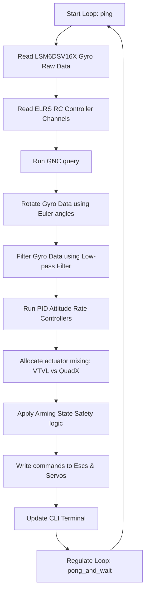

# Chesapeake FSW (Flight Software) Repository Context

This file serves as a comprehensive reference guide for LLM coding assistants to quickly bootstrap and understand the codebase layout, hardware architecture, APIs, data structures, and standard flows.

---

## 📂 Repository Directory Layout & Key Entrypoints

* **[platformio.ini](file:///C:/Users/dashs/OneDrive/Documents/PlatformIO/Projects/Chesapeake/platformio.ini)**: Core build environment configuration.
* **[README.md](file:///C:/Users/dashs/OneDrive/Documents/PlatformIO/Projects/Chesapeake/README.md)**: High-level overview and setup documentation.
* **[src/main.cpp](file:///C:/Users/dashs/OneDrive/Documents/PlatformIO/Projects/Chesapeake/src/main.cpp)**: Primary flight setup and real-time execution loop.
* **`src/gnc/`**: Guidance, Navigation, and Control modules.
  * **[src/gnc/gnc.hpp](file:///C:/Users/dashs/OneDrive/Documents/PlatformIO/Projects/Chesapeake/src/gnc/gnc.hpp)** / **[src/gnc/gnc.cpp](file:///C:/Users/dashs/OneDrive/Documents/PlatformIO/Projects/Chesapeake/src/gnc/gnc.cpp)**: Central GNC API.
  * **`src/gnc/allocation/`**: Swappable actuator mixers (VTVL and QuadX). Defined in **[src/gnc/allocation/alloc.hpp](file:///C:/Users/dashs/OneDrive/Documents/PlatformIO/Projects/Chesapeake/src/gnc/allocation/alloc.hpp)**.
  * **`src/gnc/controllers/`**: PID attitude controllers. Defined in **[src/gnc/controllers/pid.hpp](file:///C:/Users/dashs/OneDrive/Documents/PlatformIO/Projects/Chesapeake/src/gnc/controllers/pid.hpp)**.
  * **`src/gnc/filters/`**: Low-pass filter logic for sensors. Defined in **[src/gnc/filters/lowpass_filter.hpp](file:///C:/Users/dashs/OneDrive/Documents/PlatformIO/Projects/Chesapeake/src/gnc/filters/lowpass_filter.hpp)**.
  * **`src/gnc/gnc_util/`**: 3D coordinate transformations and vector math helper utilities. Defined in **[src/gnc/gnc_util/gnc_util.hpp](file:///C:/Users/dashs/OneDrive/Documents/PlatformIO/Projects/Chesapeake/src/gnc_util/gnc_util.hpp)**.
* **`src/gnc_config/`**: GNC parameter registry mapping. Defined in **[src/gnc_config/gnc_config.hpp](file:///C:/Users/dashs/OneDrive/Documents/PlatformIO/Projects/Chesapeake/src/gnc_config/gnc_config.hpp)**.
* **`src/pin_config/`**: Hardware pin maps. Defined in **[src/pin_config/pin_config.hpp](file:///C:/Users/dashs/OneDrive/Documents/PlatformIO/Projects/Chesapeake/src/pin_config/pin_config.hpp)**.
* **`src/hardware/`**: Execution rate timing utilities. Defined in **[src/hardware/hardware_util.hpp](file:///C:/Users/dashs/OneDrive/Documents/PlatformIO/Projects/Chesapeake/src/hardware/hardware_util.hpp)**.
* **[src/cli_handler.cpp](file:///C:/Users/dashs/OneDrive/Documents/PlatformIO/Projects/Chesapeake/src/cli_handler.cpp)**: Serial terminal command interpreter.
* **[src/config_manager.cpp](file:///C:/Users/dashs/OneDrive/Documents/PlatformIO/Projects/Chesapeake/src/config_manager.cpp)**: EEPROM storage load/save controller.
* **`src/tests/`**: Modular test entrypoints for IMU, Receiver, and DShot ESC hardware verification.
* **`configurator/`**: Browser Configurator Web App codebase.
  * **[configurator/index.html](file:///C:/Users/dashs/OneDrive/Documents/PlatformIO/Projects/Chesapeake/configurator/index.html)**: Front-end layout.
  * **[configurator/app.js](file:///C:/Users/dashs/OneDrive/Documents/PlatformIO/Projects/Chesapeake/configurator/app.js)**: Serial API communication and Three.js visualizer.

---

## 🛠️ Hardware Stack & Pin Mappings

Chesapeake targets the Seeed Studio Xiao RP2350 microcontroller.

### Components
* **IMU**: LSM6DSV16X 6-axis SPI accelerometer/gyroscope.
* **Receiver**: ELRS Receiver running CRSF protocol over hardware Serial.
* **Actuators**: DShot-compatible speed controllers (ESCs) and PWM servos.

### Pin Definitions
GPIO hardware pin mappings are tracked in:
* Struct layout: **[src/pin_config/pin_config.hpp](file:///C:/Users/dashs/OneDrive/Documents/PlatformIO/Projects/Chesapeake/src/pin_config/pin_config.hpp)**
* Concrete pin assignments: **[src/pin_config/pin_config.cpp](file:///C:/Users/dashs/OneDrive/Documents/PlatformIO/Projects/Chesapeake/src/pin_config/pin_config.cpp)**

---

## ⚙️ Configurable Parameters System

Parameters are persistent across reboots via the onboard EEPROM storage module.

### GNC Configurations & Defaults
GNC variables, attitude controller gains, lowpass filters, and actuator boundaries are registered in:
* Configurations structure: **[src/gnc_config/gnc_config.hpp](file:///C:/Users/dashs/OneDrive/Documents/PlatformIO/Projects/Chesapeake/src/gnc_config/gnc_config.hpp)**
* Default values & sync logic: **[src/gnc_config/gnc_config.cpp](file:///C:/Users/dashs/OneDrive/Documents/PlatformIO/Projects/Chesapeake/src/gnc_config/gnc_config.cpp)**

---

## ⚡ Real-Time Flight Loop Architecture

The main execution flow runs as a regulated periodic loop.

### Arming Safety States
Safety states disable or enable subsets of actuators based on receiver signals:
1. **Fully Disarmed**: Servos default to center, motor signals are zeroed.
2. **Servos Only**: Gimbals respond to control loops, motors remain disarmed.
3. **Fully Armed**: Gimbals and motors are fully active.

The safety state check logic and receiver thresholds are managed in **[src/main.cpp](file:///C:/Users/dashs/OneDrive/Documents/PlatformIO/Projects/Chesapeake/src/main.cpp)**.

---

## 💻 CLI Terminal Reference

A serial command interpreter allows you to query and adjust parameters at runtime:
* Dynamic RAM updates, saving changes to EEPROM, and restoring defaults.

Commands and parsers are coded in **[src/cli_handler.cpp](file:///C:/Users/dashs/OneDrive/Documents/PlatformIO/Projects/Chesapeake/src/cli_handler.cpp)**.

---

## 🔨 PlatformIO Build Environments

Build environments compile the codebase into executable targets (main software or standalone hardware test benches).
Specific source filters, build flags, and board configurations are defined in **[platformio.ini](file:///C:/Users/dashs/OneDrive/Documents/PlatformIO/Projects/Chesapeake/platformio.ini)**.

---

## 📏 Code Standards & Instructions

- Do not populate readmes with vehicle configuration specific information; it should all be broad, and focus on the general structure/purpose/functionality of the repo.
- Never, ever hardcode anything without explicit permission from the user.
- If being asked to implement large changes and the branch is "master" ask the user first if they wish to spin off a branch for changes.
- DO NOT CHANGE ANY MATH ALGORITHMS/GAINS IN THE CONFIGURATION unless explicitly asked to
- In commit messages, state clearly what LLM you are, and what you assisted with in the commit.
