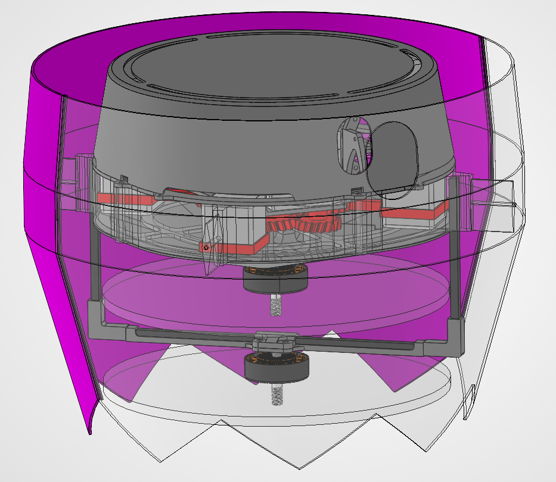

This flight software is for a vehicle called "Chesapeake." Actually, it's technically Chesapeake 2; the first one sucked and didn't work. The name comes from "Space Y" (a play on space X) since the control scheme is kind of similar to a vertically landed rocket stage. Except for the fact that Chesapeake 2 uses ballast shifting to pitch/roll instead of conventional thrust vectoring.

