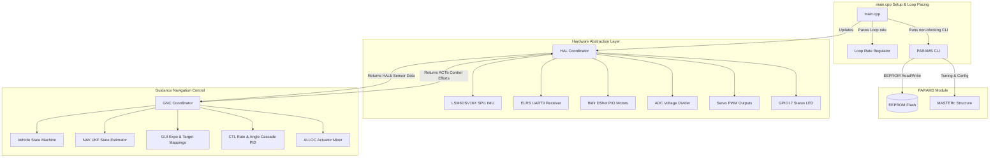

# Chesapeake Flight Control System


Chesapeake is a high-performance, modular embedded flight control firmware designed for the Seeed Studio XIAO RP2350 microcontroller. Built in C++ using PlatformIO with the Earle Philhower Arduino-Pico core, it implements state-of-the-art guidance, navigation, and control algorithms, leveraging Eigen for optimized vector mathematics, double-precision Unscented Kalman Filtering (UKF) for attitude estimation, and custom Hardware Abstraction Layer (HAL) drivers.

---

## 1. System Architecture



---

## 2. Directory Structure

```
Chesapeake/
├── hardware/
│   └── bluecrab.net       # KiCad board netlist used to map pinouts
├── lib/
│   ├── eigen-master/      # Optimized linear algebra library
│   └── UKF-main/          # Unscented Kalman Filter state estimation
├── src/
│   ├── main.cpp           # Arduino entrypoint setup and loop pacing
│   ├── PARAMS/            # Configuration management & Serial CLI
│   │   ├── MASTERc.hpp    # Master configuration structure
│   │   ├── PARAMS.hpp     # Parameter load/save & CLI runner header
│   │   ├── PARAMS.cpp     # CLI parser and get/set commands
│   │   ├── defaults.hpp   # Hardcoded default values header
│   │   └── defaults.cpp   # Base configuration factory settings
│   ├── HAL/               # Hardware Abstraction Layer
│   │   ├── bus.hpp        # HAL sub-buses (IMUb, MOTb, RCRXb)
│   │   ├── cfg.hpp        # Hardware specific config structs (IMUc, MOTc, etc.)
│   │   ├── HAL.hpp        # Master HAL class coordinator
│   │   ├── HAL.cpp        # Sequences sensor reads & motor writes
│   │   ├── IMU/           # LSM6DSV16X IMU SPI driver
│   │   ├── RCRX/          # ELRS CRSF protocol UART receiver
│   │   ├── MOT/           # Bidirectional DShot motor outputs & RPM feedback
│   │   ├── BAT/           # Analog battery voltage sensor
│   │   ├── SERVO/         # Servo.h angle command mapping
│   │   └── LED/           # Status LED driver
│   └── GNC/               # Guidance, Navigation, and Control
│       ├── bus.hpp        # Inner communication buses (VSMb, NAVb, etc.)
│       ├── cfg.hpp        # Flight control config structs (GNCc, CTLc)
│       ├── GNC.hpp        # GNC master class coordinator
│       ├── GNC.cpp        # Sequences estimations, PIDs, and mixing
│       ├── NAV/           # Navigation state estimation (translates to UKF)
│       ├── CTL/           # Attitude rate/angle control loops
│       │   └── PID/       # 3-Axis & single-axis PID controllers
│       ├── GUI/           # Target input stick mapping & RC Expo
│       ├── ALLOC/         # Actuator mixing & state-based LED blinking
│       └── VSM/           # Vehicle State Machine (Disarmed, Rate, Angle)
```

---

## 3. Hardware Interfacing & Default Pinout

The default microcontroller pin configurations are mapped from the `hardware/bluecrab.net` KiCad schematic for the Seeed Studio XIAO RP2350:

| Peripheral | Netlist Label | RP2350 Pin / GPIO | Notes |
|---|---|---|---|
| **Battery ADC** | `vbat_div` | GPIO26 (A0 / D0) | Voltage divider resistors: $R_1=9.1\text{k}\Omega$, $R_3=1.0\text{k}\Omega$ ($10.1\times$ division factor) |
| **Motor 1** | `M1` | GPIO27 (A1 / D1) | Bidirectional DShot |
| **Motor 2** | `M2` | GPIO28 (A2 / D2) | Bidirectional DShot |
| **Motor 3** | `M3` | GPIO5 (D3) | Bidirectional DShot |
| **Motor 4** | `M4` | GPIO6 (D4) | Bidirectional DShot |
| **Servo 1** | `SS1_Pin1` | GPIO7 (D5) | PWM Output |
| **Servo 2** | `SS1_Pin2` | GPIO2 (D8) | PWM Output (Shared SPI0 SCK) |
| **Servo 3** | `SS1_Pin3` | GPIO4 (D9) | PWM Output (Shared SPI0 MISO) |
| **Servo 4** | `SS1_Pin4` | GPIO3 (D10) | PWM Output (Shared SPI0 MOSI) |
| **ELRS RX** | `ELRS1_RX` | GPIO0 (TX0) | UART0 interface (`Serial1`) |
| **ELRS TX** | `ELRS1_TX` | GPIO1 (RX0) | UART0 interface (`Serial1`) |
| **IMU CS** | `IMU_CS` | GPIO9 (D18) | SPI1 Chip Select |
| **IMU SCK** | `IMU_SCK` | GPIO10 (D17) | SPI1 Bus Clock |
| **IMU MOSI**| `IMU_MOSI`| GPIO11 (D15) | SPI1 Master-Out Slave-In |
| **IMU MISO**| `IMU_MISO`| GPIO12 (D16) | SPI1 Master-In Slave-Out |
| **Status LED**| `LED_diode`| GPIO17 (D13) | Active High Status indicator |

---

## 4. Parameter Management & CLI Commands

Chesapeake includes an interactive Serial Command Line Interface (CLI) operating at 115200 baud. Parameters can be modified in RAM and committed to the RP2350 emulated EEPROM flash.

The following commands are available:
*   `help` - Show options.
*   `dump` - Print all current RAM parameter settings and values.
*   `get <param>` - Fetch the current value of a specific parameter.
*   `set <param> = <value>` - Adjust a parameter value in RAM.
*   `defaults` - Load default factory parameters into RAM.
*   `save` - Commit RAM parameters to EEPROM and reboot the flight controller.
*   `reboot` - Perform a system reboot (`rp2040.reboot()`).

### Tunable Parameters include:
*   `gnc_looprate_hz` - Core rate frequency of a Chesapeake supported board, like Bluecrab (default: 500Hz).
*   `angle_loop_hz` - Attitude loop cascade PID execution rate (default: 100Hz).
*   `led_pin` - Blink indicator pin (default: 17).
*   `blink_hz_disarmed` / `blink_hz_rate` / `blink_hz_angle` - LED blinking rates depending on VSM flight mode.
*   `roll_rate_kp` / `roll_rate_ki` / `roll_rate_kd` - Roll Rate controller PID terms (same for `pitch` and `yaw`).
*   `roll_ang_kp` - Roll Angle controller P gain (same for `pitch` and `yaw`).
*   `mot_m1_pin` to `mot_m4_pin` - Individual motor hardware pin mappings.
*   `servo_s1_pin` to `servo_s4_pin` - Individual servo hardware pin mappings.
*   `servo_min_us` / `servo_max_us` - Pulse-width limits for servos.
*   `bat_division_factor` - Calibration scaler for ADC battery readings.

---

## 5. Third-Party Libraries

Chesapeake relies on the following standard open-source libraries:
*   **[Eigen](https://libeigen.gitlab.io/)** (v3.4.99): High-performance matrix and vector math.
*   **[UKF (Unscented Kalman Filter)](https://github.com/NovelMobileRobotsLab/UKF)**: Double-precision sensor fusion and attitude estimation.
*   **[AlfredoCRSF](https://github.com/AlfredoSystems/AlfredoCRSF)** (v1.0.1): ELRS pilot control receiver mapping over CRSF protocol.
*   **[LSM6DSV16X](https://github.com/stm32duino/LSM6DSV16X)** (v2.0.3): STMicroelectronics LSM6DSV16X 6-axis SPI IMU driver.
*   **[pico-bidir-dshot](https://github.com/bastian2001/pico-bidir-dshot)** (v1.0.2): PIO-driven bidirectional DShot throttle signal and RPM telemetry return.
*   **[Servo(rp2040)](https://github.com/earlephilhower/arduino-pico)** (v1.0.0): Hardware PWM servo command generation.

---
Assisted by Gemini.
